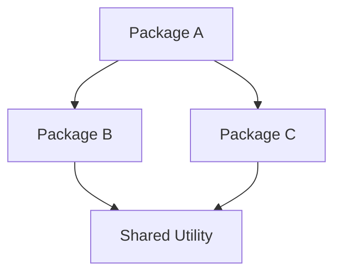
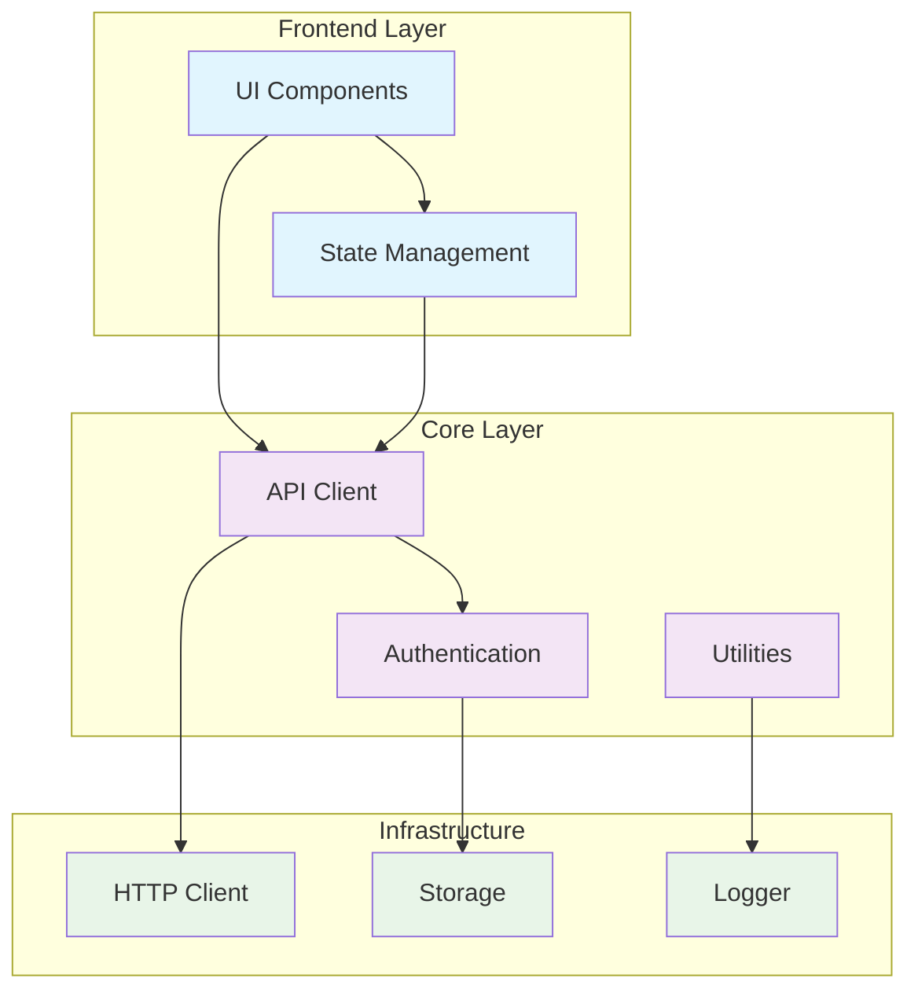

# Browser Agent Infra

Browser Agent Infra is dedicated to building a comprehensive browser infrastructure toolkit designed for AI agents and browser automation.

This monorepo provides a complete set of packages for browser detection, control and UI interaction -—— everything you need to build intelligent browser automation systems.

Currently, the business users of this Infra include [UI-TARS-desktop](https://github.com/bytedance/UI-TARS-desktop/#ui-tars-desktop) and [Agent TARS](https://github.com/bytedance/UI-TARS-desktop/#agent-tars), with more agents or apps to be integrated in the future.


## What is this for?

This toolkit is specifically designed for:

- **AI Agents** that need to interact with web browsers
- **Browser Automation** tools and testing frameworks
- **Remote Browser Control** applications
- **Web Scraping** and data extraction systems
- **Cross-platform Browser** detection and management


## Architecture

```
┌─────────────────────────────────────────────────────────────┐
│                    Agent Browser Infra                      │
├─────────────────┬─────────────────┬─────────────────────────┤
│   Browser UI    │   Browser Core  │    Browser Use          │
│   (React)       │   (Puppeteer)   │    (AI Agents)          │
├─────────────────┼─────────────────┼─────────────────────────┤
│ Browser Finder  │ Media Utils     │ Puppeteer Enhance       │
│ (Detection)     │ (Processing)    │ (Enhancements)          │
└─────────────────┴─────────────────┴─────────────────────────┘
```







```mermaid
graph TB
    subgraph "Browser Context Package"
        EXT[extractContent]
        DEF[extractWithDefuddle]
        READ[extractWithReadability] 
        MD[toMarkdown]
    end
    
    subgraph "External Dependencies"
        DEFUDDLE[@mozilla/defuddle]
        READABILITY[@mozilla/readability]
        TURNDOWN[turndown]
        PUPPETEER[puppeteer]
    end
    
    EXT --> DEF
    EXT --> READ
    DEF --> DEFUDDLE
    READ --> READABILITY
    MD --> TURNDOWN
    EXT --> PUPPETEER
    READ --> PUPPETEER
    
    classDef internal fill:#bbdefb
    classDef external fill:#c8e6c9
    
    class EXT,DEF,READ,MD internal
    class DEFUDDLE,READABILITY,TURNDOWN,PUPPETEER external
```


## Packages Overview

### [@agent-infra/browser](./packages/browser)

**Core Browser Control Library**

A lightweight wrapper around Puppeteer that provides simplified browser management with support for both local and remote browser instances.


### [@agent-infra/browser-ui](./packages/browser-ui)

**Browser Interface Components**

UI components for displaying and interacting with remote browser instances through Chrome DevTools Protocol (CDP).


### [@agent-infra/browser-use](./packages/browser-use)

**AI Agent Browser Automation**

Advanced browser automation library specifically designed for AI agents, providing structured DOM access and intelligent interaction capabilities.


### [@agent-infra/browser-finder](./packages/browser-finder) 

**Cross-Platform Browser Detection**

Automatically locate installed browsers (Chrome, Edge, Firefox) on Windows, macOS, and Linux systems.


### [@agent-infra/puppeteer-enhance](./packages/puppeteer-enhance)

**Enhanced Puppeteer Features**

A collection of tools that enhance Puppeteer functionality, such as hotkey support and common injection scripts.


### [@agent-infra/media-utils](./packages/media-utils)
**Media Processing Utilities**

Media tools for handling browser-related tasks, such as high-performance base64 image parsing and media resource processing.


## Development

This is a monorepo managed with **pnpm**. To get started:

```bash
# Install dependencies
pnpm install

# Build all packages
pnpm run build

# Run tests
pnpm run test

# Lint code
pnpm run lint
```


## Requirements

- **Node.js** >= 20.x
- **pnpm** for package management
- Chrome/Chromium browser for browser automation features


## License

This project is licensed under the Apache License 2.0.


## Credits

Special thanks to the open source projects that inspired this toolkit:

- [Puppeteer](https://github.com/puppeteer/puppeteer) - Browser automation foundation
- [browser-use](https://github.com/browser-use/browser-use) - AI browser automation inspiration
- [ChatWise](https://chatwise.app/) - Browser detection functionality reference
- [nanobrowser](https://github.com/nanobrowser/nanobrowser) - Technical references for browser integration
