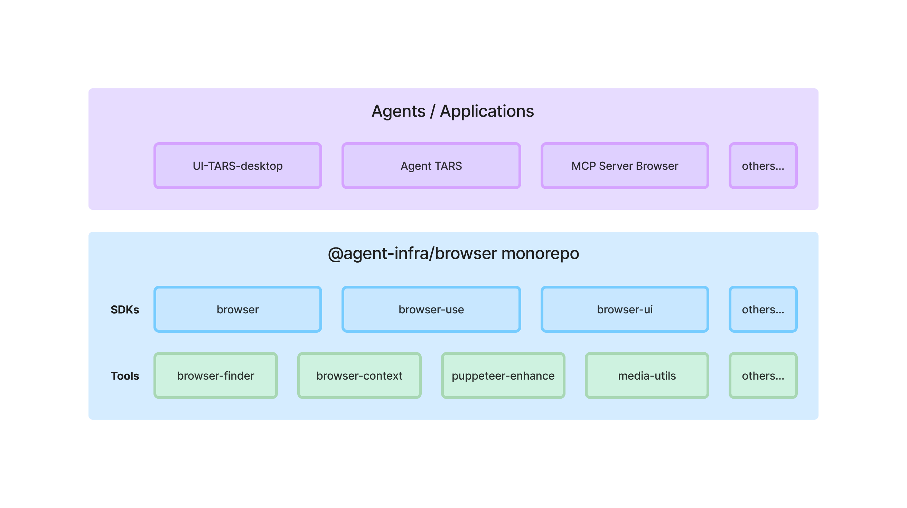

<div align="right">
  <a href="README.zh-CN.md">简体中文</a> | <b>English</b>
</div>

# Agent Infra Browser

@agent-infra/browser is dedicated to building a comprehensive browser infrastructure SDK specifically designed for AI Agents.

<br />

## What is this for?

This toolkit is specifically designed for:

- **GUI AI Agent** that needs to interact with web browsers
- **Browser screen casting** in non-VNC or headless scenarios
- **MCP service** for browser automation control

## Architecture



## Packages Overview

### [@agent-infra/browser](./packages/browser)

**Core Browser Control Library**. Abstracts and encapsulates the fundamental capabilities required to manipulate browsers.

### [@agent-infra/browser-ui](./packages/browser-ui)

**Browser Screen Casting UI Components**. Can connect to remote browsers via CDP and then display their screen casting content.

<div align="center">
  <video src="https://github.com/user-attachments/assets/7394eccc-0d07-4764-8265-aa5b4b56d5f7" controls width="600"></video>
</div>

### [@agent-infra/browser-finder](./packages/browser-finder)

**Cross-Platform Browser Detection**. Automatically locate installed browsers (Chrome, Edge, Firefox) on Windows, macOS, and Linux systems.

### [@agent-infra/browser-context](./packages/browser-context)

**Smart Web Content Extraction**. Extract clean, readable content from web pages and convert to Markdown format with advanced algorithms and browser automation support.

### [@agent-infra/media-utils](./packages/media-utils)

**Media Processing Utilities**. Media tools for handling browser-related tasks, such as high-performance base64 image parsing and media resource processing.

<br />

## Development

This is a monorepo managed with **pnpm**. To get started:

```bash
# Install dependencies
pnpm install

# Build all packages
pnpm run build

# Run tests
pnpm run test

# Lint code
pnpm run format
```

<br />

## Requirements

- **Node.js** >= 20.x
- **pnpm** for package management
- **Chrome/Chromium** browser for browser automation features

<br />

## License

This project is licensed under the Apache License 2.0.

<br />

## Credits

Special thanks to the open source projects that inspired this toolkit:

- [puppeteer](https://github.com/puppeteer/puppeteer) - The underlying browser automation library
- [Chrome DevTools Protocol](https://chromedevtools.github.io/devtools-protocol/) - Chrome DevTools Protocol
- [ChatWise](https://chatwise.app/) - Browser detection functionality reference
- [readability](https://github.com/mozilla/readability/) - A standalone version of the readability lib
- [edge-paths](https://github.com/shirshak55/edge-paths) - Edge browser path finder
